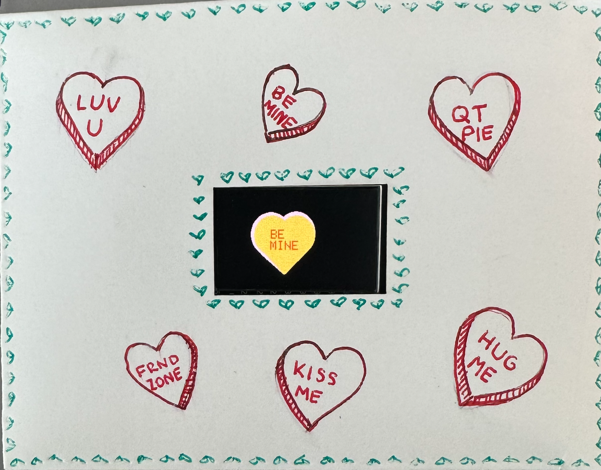

# Module 1: Generative Art, Valentine's Day Installation
## Project Overview
This project is a part of the first module of the Spring 2024 Creative Embedded Systems (COMS3930) class at Barnard College. 
For Valentine's Day, we created a public installation consisting of individual TTGO Displays with various animations embedded in envelopes suspended from the ceiling.

For my piece, in the spirit of the holiday, I animated a randomized candy heart. 
The heart randomly cycles through Valentine's Day themed sayings paired with pastel colors. 
When the green battery on the lower left-hand side of the envelope is pressed, the battery life is displayed on the screen to monitor power usage.
Every 5 seconds, the display goes into deep sleep mode to conserve battery.

Installation Video: [https://youtube.com/shorts/8n0QKmH3J9U?feature=share](https://www.youtube.com/watch?v=LqiJ4ObK-KU)

## Materials
### Hardware/software
- ESP32 TTGO T-display
- 220mAmp battery
- USB-C
- Mac (version 13.X)
- Arduino IDE (https://www.arduino.cc/en/software)

### Installation materials
- Envelope
- Scotch tape
- Twine (~3ft)
- Popsicle stick
- Shrink wrap
- Art suplies of your choice

### Tools
- Drill
- Heat gun
- Scissors
- Hole puncher

## Getting Started
1. Download Arduino IDE (2.2.1)
2. Download driver to get port /dev/cu.wchusbserialXXXXXXXX: https://www.wch.cn/downloads/CH34XSER_MAC_ZIP.html

## Setting Up IDE
1. Navigate to Preferences: Ardunio --> Settings 
2. To enable the board, in Additional Boards Manager, copy and paste URL: https://dl.espressif.com/dl/package_esp32_index.json
3. Navigate to Tools --> Board, Select ESP32 Arduino --> TTGO T1
4. Return to Tools, select Port --> /dev/cu.wchusbserialXXXXXXXX
5. In Tools, also select Manage library, install tft_eSPI by Bodner
6. In your computer's finder, go to file User_Setup_Select.h, comment out all the lines except for line: `#include<User_Setups/Setup25_TTGO_T_Display.h>`

## Dowload and Upload Code
1. To Download the code: `git clone https://github.com/ravenrothkopf/Creative-Embedded-Systems/Module`
2. Open the file `candy_hearts.ino` in the Arduino IDE
3. Plug in USB-C into computer and the ESP32
4. Select Upload to flash the code to the ESP32

## Instalation
1. Cut a rectangle the size of your TTGO T-Display screen out of the front of your envelope.
2. Decorate your envelope with your chosen art suplies.
4. Cut two 1cm pieces of shrink wrap.
6. Use the heat gun to mold the shrink wrap to the exposed metal part of the red and black wires of the adapter.

8. Connect the adapter to the battery, and then connect the other side to the ESP32.
9. Place the battery, adapter, and ESP32 inside of the envelope so that the ESP32 screen is displayed. Use tape to secure the ESP32 and battery safely to the inside of the envelope.

11. Punch a hole in your envelope and tie one side of your twine around that hole.
12. Drill a hole in your popsicle stick and tie the other side of your twine around that hole. Secure with tape.

14. Hang the popsicle stick from the cieling so that your envelope is on display.
15. Enjoy!

